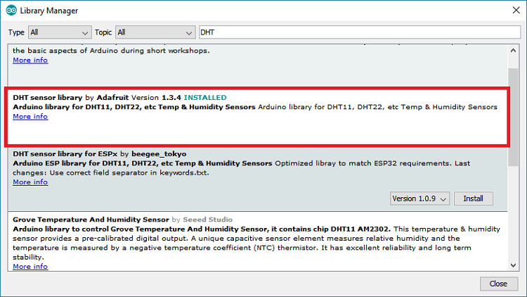

# Space farming using food computers for sustainable farming

The curriculum aims at introducing different digital skills for the 21st century. This includes the Internet of Things \(IoT\), Machine Learning \(ML\) and Data Science. The participants are encouraged to apply their newly acquired skills to build food computers that will be used to grow crops. This will be a great project to learn about methods that can be used for sustainable farming as an answer to combating the effects of global climate change.‌

### Internet of Things 

‌The participants will get to learn the basics of Arduino and Raspberry. We will also introduce the basics of programming, the different sensors that will be used in this project and how to connect them to micro-controllers and control them remotely via a smartphone.‌

### Data Science 

‌  

