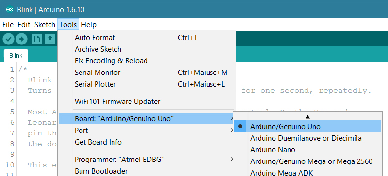
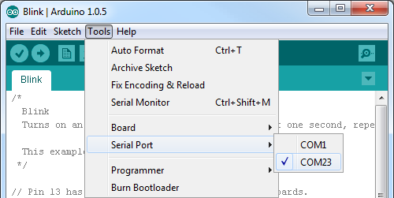

# Controlling LEDs with an Arduino

### What will you need ?

* An Arduino Uno board 
* 3 X LEDs \(of different colors\)
* male-to-male jumper wires.
* 3 X 100 ohm \(black-brown-black\) resistor.
* Breadboard 
* A computer with the Arduino IDE software.

Connect the anode \(long leg\) of each LED to digital pins eight, nine, and ten \(via the 100 resistors\). Connect the cathodes \(short leg\) to Arduino ground. According to the diagram below:

On your computer, open the Arduino IDE program. Connect the USB cable to the computer and the Arduino board. 

On the IDE, select the relevant board and the COM port according to the following diagram: 

