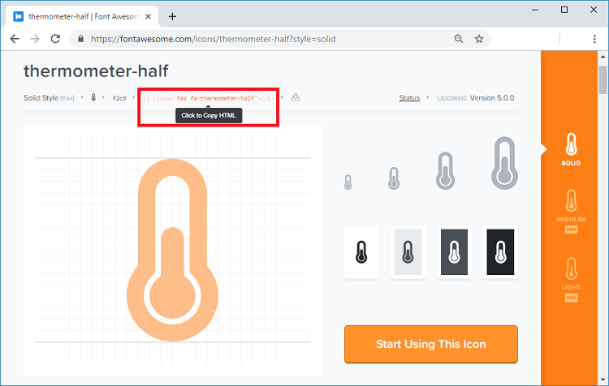

# Designing and building the web page

In order to build the web page we will store all the HTML text and CSS styles in the index\_html variable in the Arduino code.

Open the Arduino IDE and declare the index\_html variable as follows:

```text
const char index_html[] PROGMEM = R"rawliteral( )
```

Add the &lt;meta&gt; tag. This is important as it is used to make your web page responsive:

```text
<meta name="viewport" content="width=device-width, initial-scale=1">
```

The  tag is needed to load the icons from the fontawesome website.

```text
<link rel="stylesheet" href="https://use.fontawesome.com/releases/v5.7.2/css/all.css" integrity="sha384-fnmOCqbTlWIlj8LyTjo7mOUStjsKC4pOpQbqyi7RrhN7udi9RwhKkMHpvLbHG9Sr" crossorigin="anonymous">
```

#### Styles:

Between the  tags, we add some CSS to style the web page.

```text
<style>
 html {
   font-family: Arial;
   display: inline-block;
   margin: 0px auto;
   text-align: center;
  }
  h2 { font-size: 3.0rem; }
  p { font-size: 3.0rem; }
  .units { font-size: 1.2rem; }
  .ds-labels{
    font-size: 1.5rem;
    vertical-align:middle;
    padding-bottom: 15px;
  }
</style>
```

We are setting the HTML page to be written in Arial font with block without margin and aligned to the center:

```text
html {
  font-family: Arial;
  display: inline-block;
  margin: 0px auto;
  text-align: center;
}
```

We set the font size for the heading \(h2\), paragraph \(p\) and the units\(.units\) of the readings.


```text
h2 { font-size: 3.0rem; }
p { font-size: 3.0rem; }
.units { font-size: 1.2rem; }
```

All of the previous tags should go between the  and tags. These tags are used to include content that is not directly visible to the user, like the  , the  tags, and the styles.

The labels for the readings are styled as shown below:

```text
ds-labels{
  font-size: 1.5rem;
  vertical-align:middle;
  padding-bottom: 15px;
}
```

#### HTML Body 

Inside the &lt;body&gt;&lt;/body&gt; tags is where we add the web page content.  
The &lt;h2&gt;&lt;/h2&gt; tags add a heading to the web page. In this case, the “ESP DS18B20 server” text, but you can add any other text.

Then we add the two paragraphs. One is for the temperature in celsius while the other is in Fahrenheit. The paragraphs are delimited by the  and tags.

**Temperature in Celsius**

```text
 <p>
    <i class="fas fa-thermometer-half" style="color:#059e8a;"></i> 
    <span class="ds-labels">Temperature Celsius</span> 
    <span id="temperaturec">%TEMPERATUREC%</span>
    <sup class="units">&deg;C</sup>
  </p>
```

 **Temperature in Fahrenheit**

\*\*\*\*

```text
<p>
    <i class="fas fa-thermometer-half" style="color:#059e8a;"></i> 
    <span class="ds-labels">Temperature Fahrenheit</span>
    <span id="temperaturef">%TEMPERATUREF%</span>
    <sup class="units">&deg;F</sup>
  </p>
```

The &lt;i&gt; tags display the fontawesome icons.

**Displaying Icons**

 To chose the icons, go to the [Font Awesome Icons website](https://fontawesome.com/icons?d=gallery).


Search the icon you’re looking for. For example, “thermometer”:


Click the desired icon. Then, you just need to copy the HTML text provided.




To chose the color, you just need to pass the style parameter with the color in hexadecimal, as follows:

```text
<i class="fas fa-tint" style="color:#00add6;"></i> 
```

Proceeding with the HTML text…

The next line writes the word “Temperature” into the web page.

```text
<span class="ds-labels">Temperature Celsius</span>
```

The TEMPERATURE text between % signs is a placeholder for the temperature value.  


```text
<span id="temperaturec">%TEMPERATUREC%</span>
```


This means that this **%TEMPERATURE%** text is like a variable that will be replaced by the actual temperature value from the DHT sensor. The placeholders on the HTML text should go between % signs.

Finally, we add the degree symbol.  


```text
<sup class="units">&deg;C</sup>
```

The  tags make the text superscript.

We do the same for the paragraph with temperature in Fahrenheit.

```text
<p>
    <i class="fas fa-thermometer-half" style="color:#059e8a;"></i> 
    <span class="ds-labels">Temperature Fahrenheit</span>
    <span id="temperaturef">%TEMPERATUREF%</span>
    <sup class="units">&deg;F</sup>
  </p>
```

 **Automatic updates**

Finally, there’s some JavaScript code in our web page that updates the temperature and humidity automatically, every 10 seconds.

Scripts in HTML text should go between the &lt;script&gt;&lt;/script&gt; tags.

```text
<script>
setInterval(function ( ) {
  var xhttp = new XMLHttpRequest();
  xhttp.onreadystatechange = function() {
    if (this.readyState == 4 && this.status == 200) {
      document.getElementById("temperature").innerHTML = this.responseText;
    }
  };
  xhttp.open("GET", "/temperature", true);
  xhttp.send();
}, 10000 ) ;

setInterval(function ( ) {
  var xhttp = new XMLHttpRequest();
  xhttp.onreadystatechange = function() {
    if (this.readyState == 4 && this.status == 200) {
      document.getElementById("humidity").innerHTML = this.responseText;
    }
  };
  xhttp.open("GET", "/humidity", true);
  xhttp.send();
}, 10000 ) ;
</script>
```

To update the temperature **in celsius** on the background, we have a setInterval\(\) function that runs every 10 seconds.

Basically, it makes a request in the _/temperature_ URL to get the latest temperature reading.

```text
  xhttp.open("GET", "/temperaturec", true);
  xhttp.send();
}, 10000 ) ;
```

When it receives that value, it updates the HTML element whose id is temperaturec.

```text
if (this.readyState == 4 && this.status == 200) {
      document.getElementById("temperaturec").innerHTML = this.responseText;
    }
```

In summary, this previous section is responsible for updating the temperature asynchronously. The same process is repeated for the temperature in Fahrenheit

**Processor** 

Now, we need to create the processor\(\) function, that will replace the placeholders in our HTML text with the actual temperature

```text
String processor(const String& var){
  //Serial.println(var);
  if(var == "TEMPERATUREC"){
    return readDSTemperatureC();
  }
  else if(var == "TEMPERATUREF"){
    return readDSTemperatureF();
  }
  return String();
}
```


