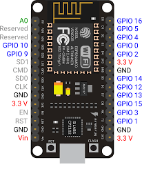

# Introducing the NodeMCU

### The NodeMCU ESP8266 WiFi Board 

The NodeMCU is also an open source board that is based on the ESP8266 WiFi module. Just like the Uno, it is also low-cost and ideal for building robust IoT projects.

