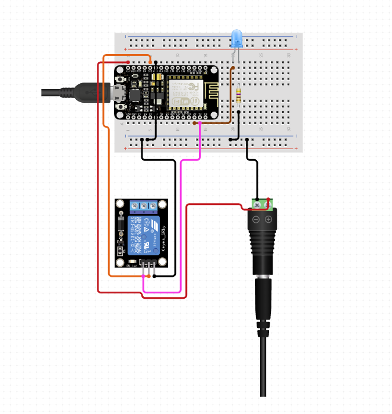

# A light bulb switch using NodeMCU and the Blynk app

### The outcome of this workshop/tutorial 

* Learn how to setup the circuit for the relay, light bulb and the nodeMCU.
* Learn how to use a relay module to switch a light bulb on and off.
* Learn to connect the relay module to the power supply.
* Learn to setup the Blynk app on your smartphone.
* Learn how to install the Blynk Library on the Arduino IDE.
* Learn how to configure the Blynk to connect to your local network.
* Learn how to configure Blynk code to communicate with your nodeMCU and Blynk app.


### What will you need?

* NodeMCU Dev Kit
* male-to-male & male-to-female jumper cables 
* A relay Module 
* A 220V light bulb
* globe holder 
* breadboard 
* 5 V power supply

### Setting up the circuit



1. Connect the positive terminal of the 5V power supply to the positive on the breadboard. Also connect the negative terminal on the negative of the breadboard. 
2. Connect the positive pin of the relay module to the positive on the breadboard. Then connect the negative pin of the relay module to the negative on the breadboard.
3. Connect the signal pin of the relay to pin D0 on the nodeMC.
4. Connect the long leg of the LED to the 

```text
#define BLYNK_PRINT Serial        
#include <ESP8266WiFi.h>        
#include <BlynkSimpleEsp8266.h>        
char auth[] = "authtocken"; // PASTE YOUR AUTHENTICATION CODE HERE        
// Your WiFi credentials.        
char ssid[] = "ssid"; //WIFI NAME        
char pass[] = "password"; //PASSWORD        
void setup()        
{        
 Serial.begin(9600);        
 Blynk.begin(auth, ssid, pass);        
}        
void loop()        
{        
 Blynk.run();        
}        
```

