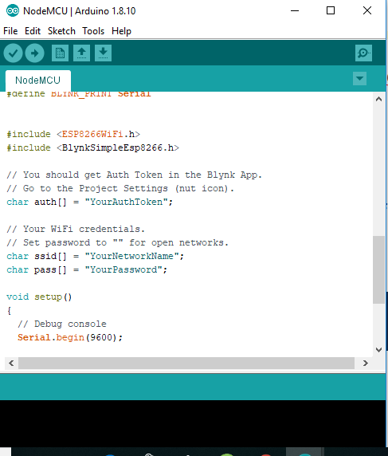

# Controlling a Centurion gate Motor with NodeMCU a 2-channel relay

For this activity we will be controlling the Centurion gate motor with a 2-channel relay. We will be using the Arduino-based nodeMCU and the Blynk mobile app to control the relay. The Blynk app will have two buttons. One will be to open and the other will be to close the gate. 

#### What will you need ?

* NodeMCU dev kit 
* 2-channel relay 
* An android smartphone with the Blynk app installed.
* male-to-female jumper cables
* a desktop computer/laptop with the Arduino IDE installed 

If this is the first time working with the NodeMCU, you will need to install the ESP8266 board on the Arduino IDE as demonstrated here: 

1.  The first thing you will need to do is install the Blynk app on your smartphone and create a New Project. Once you have created it, you will receive the authentication code via the e-mail address that you you signed up with.  
2. 
2. The second thing you will need to do is to add the is include the example code for blynk using the nodeMCU board. 

click on **File &gt; Examples &gt; Blynk &gt; Boards\_WiFi &gt; NodeMCU** 

This will be the code that you get:



```text
/*************************************************************
  Download latest Blynk library here:
    https://github.com/blynkkk/blynk-library/releases/latest

  Blynk is a platform with iOS and Android apps to control
  Arduino, Raspberry Pi and the likes over the Internet.
  You can easily build graphic interfaces for all your
  projects by simply dragging and dropping widgets.

    Downloads, docs, tutorials: http://www.blynk.cc
    Sketch generator:           http://examples.blynk.cc
    Blynk community:            http://community.blynk.cc
    Follow us:                  http://www.fb.com/blynkapp
                                http://twitter.com/blynk_app

  Blynk library is licensed under MIT license
  This example code is in public domain.

 *************************************************************
  This example runs directly on NodeMCU.

  Note: This requires ESP8266 support package:
    https://github.com/esp8266/Arduino

  Please be sure to select the right NodeMCU module
  in the Tools -> Board menu!

  For advanced settings please follow ESP examples :
   - ESP8266_Standalone_Manual_IP.ino
   - ESP8266_Standalone_SmartConfig.ino
   - ESP8266_Standalone_SSL.ino

  Change WiFi ssid, pass, and Blynk auth token to run :)
  Feel free to apply it to any other example. It's simple!
 *************************************************************/

/* Comment this out to disable prints and save space */
#define BLYNK_PRINT Serial


#include <ESP8266WiFi.h>
#include <BlynkSimpleEsp8266.h>

// You should get Auth Token in the Blynk App.
// Go to the Project Settings (nut icon).
char auth[] = "YourAuthToken";

// Your WiFi credentials.
// Set password to "" for open networks.
char ssid[] = "YourNetworkName";
char pass[] = "YourPassword";

void setup()
{
  // Debug console
  Serial.begin(9600);

  Blynk.begin(auth, ssid, pass);
  // You can also specify server:
  //Blynk.begin(auth, ssid, pass, "blynk-cloud.com", 80);
  //Blynk.begin(auth, ssid, pass, IPAddress(192,168,1,100), 8080);
}

void loop()
{
  Blynk.run();
}

```


