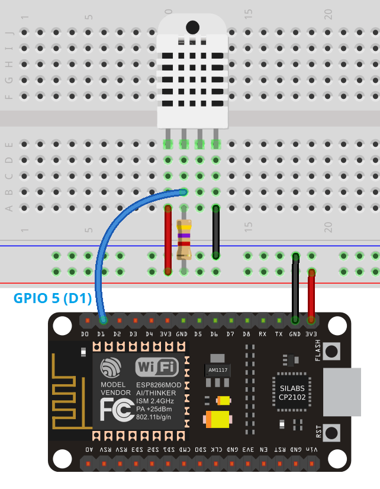

# Display the DHT11 sensor reading on a web server using NodeMCU.

The first thing that we need to do is to setup the circuit. For this project we will using the following components:

**What will you need ?** 

* ESP8266 NodeMCU Dev kit board.
* male-to-male jumper wires 
* DHT11 humidity and temperature sensor 
* 4.7k Ohm resistor
* Breadboard 

#### Setting up the circuit

Setup the circuit so that it looks like the one in the diagram below:

In this activity, we’re wiring the DHT data pin to GPIO5 \(D1\), but you can use any other suitable GPIO. Read our [ESP8266 GPIO Reference Guide](https://randomnerdtutorials.com/esp8266-pinout-reference-gpios/) to learn more about the ESP8266 GPIOs.

