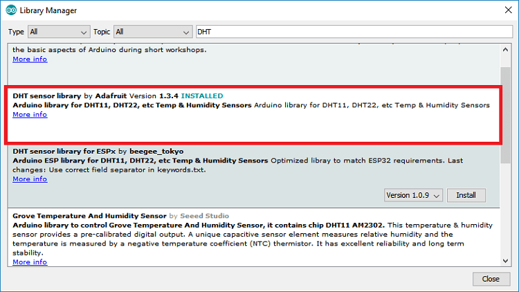
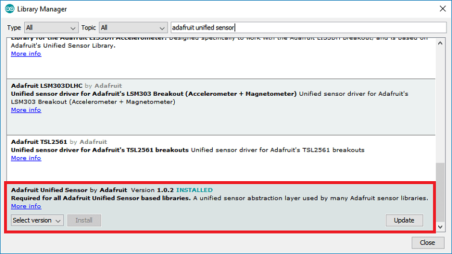

# Installing DHT library on the ESP8266

 To read from the DHT sensor, we’ll use the [DHT library from Adafruit](https://github.com/adafruit/DHT-sensor-library). To use this library you also need to install the [Adafruit Unified Sensor library](https://github.com/adafruit/Adafruit_Sensor). Follow the next steps to install those libraries.

1.  Open your Arduino IDE and go to **Sketch** &gt; **Include Library** &gt; **Manage Libraries**. The Library Manager should open.
2.  Search for “**DHT**” on the Search box and install the DHT library from Adafruit.   

 3. After installing the DHT library from Adafruit, type “**Adafruit Unified Sensor**” in the search box. Scroll all the way down to find the library and install it.  
  

