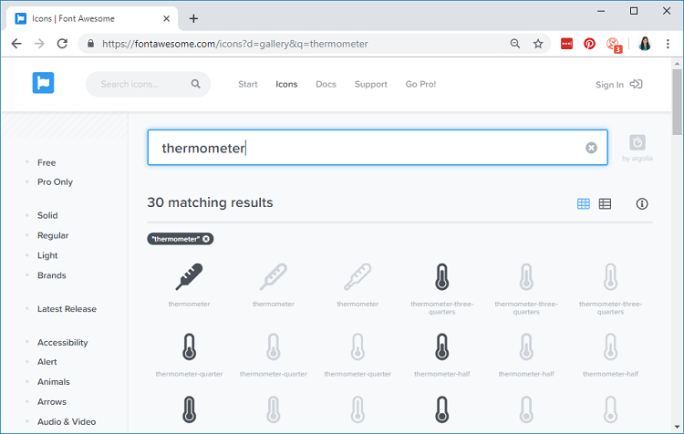

# Designing and building the web page


As you can see in the above figure, the web page shows one heading and two paragraphs. There is a paragraph to display the temperature and another to display the humidity. There are also two icons to style the page.

Let’s see how this web page is created.

All the HTML text with styles included is stored in the index\_html variable. Now we’ll go through the HTML text and see what each part does.

The following &lt;meta&gt; tag makes your web page responsive in any browser.

```text
<meta name="viewport" content="width=device-width, initial-scale=1">
```

The &lt;link&gt; tag is needed to load the icons from the fontawesome website.

```text
<link rel="stylesheet" href="https://use.fontawesome.com/releases/v5.7.2/css/all.css" integrity="sha384
```

**Styles**

Between the &lt;style&gt;&lt;/style&gt; tags, we add some CSS to style the web page.

```text
<style>
 html {
   font-family: Arial;
   display: inline-block;
   margin: 0px auto;
   text-align: center;
  }
  h2 { font-size: 3.0rem; }
  p { font-size: 3.0rem; }
  .units { font-size: 1.2rem; }
  .dht-labels{
    font-size: 1.5rem;
    vertical-align:middle;
    padding-bottom: 15px;
  }
</style>
```

Basically, we’re setting the HTML page to display the text with Arial font in block without margin, and aligned at the center.

```text
html {
  font-family: Arial;
  display: inline-block;
  margin: 0px auto;
  text-align: center;
}
```

We set the font size for the heading \(h2\), paragraph \(p\) and the units\(.units\) of the readings.

```text
h2 { font-size: 3.0rem; }
p { font-size: 3.0rem; }
.units { font-size: 1.2rem; }
```

The labels for the readings are styled as shown below:

```text
dht-labels{
  font-size: 1.5rem;
  vertical-align:middle;
  padding-bottom: 15px;
}
```

All of the previous tags should go between the &lt;head&gt; and &lt;/head&gt; tags. These tags are used to include content that is not directly visible to the user, like the &lt;meta&gt; , the &lt;link&gt; tags, and the styles.

**HTML Body**

Inside the &lt;body&gt;&lt;/body&gt; tags is where we add the web page content.  


The &lt;h2&gt;&lt;/h2&gt; tags add a heading to the web page. In this case, the “ESP8266 DHT server” text, but you can add any other text.  


```text
<h2>ESP8266 DHT Server</h2>
```

Then, there are two paragraphs. One to display the temperature and the other to display the humidity. The paragraphs are delimited by the &lt;p&gt; and &lt;/p&gt; tags. The paragraph for the temperature is the following:

```text
<p>
  <i class="fas fa-thermometer-half" style="color:#059e8a;"</i> 
  <span class="dht-labels">Temperature</span> 
  <span id="temperature">%TEMPERATURE%</span>
  <sup class="units">°C</sup>
</p>
```

And the paragraph for the humidity is on the following snipet:

```text
<p>
  <i class="fas fa-tint" style="color:#00add6;"></i> 
  <span class="dht-labels">Humidity</span>
  <span id="humidity">%HUMIDITY%</span>
  <sup class="units">%</sup>
</p>
```

The &lt;i&gt; tags display the fontawesome icons.

**How to display icons**

To chose the icons, go to the [Font Awesome Icons website](https://fontawesome.com/icons?d=gallery).  


Search the icon you’re looking for. For example, “thermometer”:



Click the desired icon. Then, you just need to copy the HTML text provided.


To chose the color, you just need to pass the style parameter with the color in hexadecimal, as follows:

```text
<i class="fas fa-tint" style="color:#00add6;"></i> 
```

Proceeding with the HTML text…

The next line writes the word “Temperature” into the web page.

```text
<span class="dht-labels">Temperature</span>
```

The TEMPERATURE text between % signs is a placeholder for the temperature value.  


```text
<span id="temperature">%TEMPERATURE%</span>
```

This means that this **%TEMPERATURE%** text is like a variable that will be replaced by the actual temperature value from the DHT sensor. The placeholders on the HTML text should go between % signs.

Finally, we add the degree symbol.  


```text
<sup class="units">°C</sup>
```

The &lt;sup&gt;&lt;/sup&gt; tags make the text superscript.

We use the same approach for the humidity paragraph, but it uses a different icon and the **%HUMIDITY%** placeholder.  


```text
<p>
  <i class="fas fa-tint" style="color:#00add6;"></i> 
  <span class="dht-labels">Humidity</span>
  <span id="humidity">%HUMIDITY%</span>
  <sup class="units">%</sup>
</p>
```

**Automatic Updates**

Finally, there’s some JavaScript code in our web page that updates the temperature and humidity automatically, every 10 seconds.

Scripts in HTML text should go between the &lt;script&gt;&lt;/script&gt; tags.

```text
<script>
setInterval(function ( ) {
  var xhttp = new XMLHttpRequest();
  xhttp.onreadystatechange = function() {
    if (this.readyState == 4 && this.status == 200) {
      document.getElementById("temperature").innerHTML = this.responseText;
    }
  };
  xhttp.open("GET", "/temperature", true);
  xhttp.send();
}, 10000 ) ;

setInterval(function ( ) {
  var xhttp = new XMLHttpRequest();
  xhttp.onreadystatechange = function() {
    if (this.readyState == 4 && this.status == 200) {
      document.getElementById("humidity").innerHTML = this.responseText;
    }
  };
  xhttp.open("GET", "/humidity", true);
  xhttp.send();
}, 10000 ) ;
</script>
```

To update the temperature on the background, we have a setInterval\(\) function that runs every 10 seconds.

Basically, it makes a request in the _/temperature_ URL to get the latest temperature reading.

```text
  xhttp.open("GET", "/temperature", true);
  xhttp.send();
}, 10000 ) ;
```

When it receives that value, it updates the HTML element whose id is temperature.

```text
if (this.readyState == 4 && this.status == 200) {
  document.getElementById("temperature").innerHTML = this.responseText;
}
```

In summary, this previous section is responsible for updating the temperature asynchronously. The same process is repeated for the humidity readings.

**Processor**

Now, we need to create the processor\(\) function, that will replace the placeholders in our HTML text with the actual temperature and humidity values.  


```text
String processor(const String& var){
  //Serial.println(var);
  if(var == "TEMPERATURE"){
    return String(t);
  }
  else if(var == "HUMIDITY"){
    return String(h);
  }
  return String();
}
```

When the web page is requested, we check if the HTML has any placeholders. If it finds the **%TEMPERATURE%** placeholder, we return the temperature that is stored on the t variable.  


```text
if(var == "TEMPERATURE"){
  return String(t);
}
```

If the placeholder is **%HUMIDITY%**, we return the humidity value.  


```text
else if(var == "HUMIDITY"){
  return String(h);
}
```

**setup\(\)**

In the setup\(\), initialize the Serial Monitor for debugging purposes.  


```text
Serial.begin(115200);
```

Initialize the DHT sensor.  


```text
dht.begin();
```

Connect to your local network and print the ESP8266 IP address.  


```text
WiFi.begin(ssid, password);
while (WiFi.status() != WL_CONNECTED) {
  delay(1000);
  Serial.println("Connecting to WiFi..");
}
```

Finally, add the next lines of code to handle the web server.  


```text
server.on("/", HTTP_GET, [](AsyncWebServerRequest *request){
  request->send_P(200, "text/html", index_html, processor);
});
server.on("/temperature", HTTP_GET, [](AsyncWebServerRequest *request){
  request->send_P(200, "text/plain", String(t).c_str());
});
server.on("/humidity", HTTP_GET, [](AsyncWebServerRequest *request){
  request->send_P(200, "text/plain", String(h).c_str());
});
```

When we make a request on the root URL, we send the HTML text that is stored on the index\_html variable. We also need to pass the processorfunction, that will replace all the placeholders with the right values.  


```text
server.on("/", HTTP_GET, [](AsyncWebServerRequest *request){
  request->send_P(200, "text/html", index_html, processor);
});
```

We need to add two additional handlers to update the temperature and humidity readings. When we receive a request on the _/temperature_ URL, we simply need to send the updated temperature value. It is plain text, and it should be sent as a char, so, we use the c\_str\(\) method.  


```text
server.on("/temperature", HTTP_GET, [](AsyncWebServerRequest *request){
  request->send_P(200, "text/plain", String(t).c_str());
});
```

The same process is repeated for the humidity.  


```text
server.on("/humidity", HTTP_GET, [](AsyncWebServerRequest *request){
  request->send_P(200, "text/plain", String(h).c_str());
});
```

Lastly, we can start the server.  


```text
server.begin();
```

In the loop\(\) is where we get new temperature readings from the sensor every 10 seconds.

Basically, we check if it is time to get new sensor readings:

```text
if (currentMillis - previousMillis >= interval) {
```

If it is, we store a new temperature reading on the newT variable

```text
float newT = dht.readTemperature();
```

If the newT variable is a valid temperature readings, we update the t variable.

```text
else {
  t = newT;
  Serial.println(t);
}
```

The same process is repeated for the humidity.

```text
// Read Humidity
float newH = dht.readHumidity();
// if humidity read failed, don't change h value 
if (isnan(newH)) {
   Serial.println("Failed to read from DHT sensor!");
}
else {
  h = newH;
  Serial.println(h);
}
```

**Uploading the code**

Make sure you have the right board and COM port select. Go to **Tools&gt; Board** and select the ESP8266 model you’re using. In our case, we’re using the ESP8266 12-E NodeMCU Kit.


