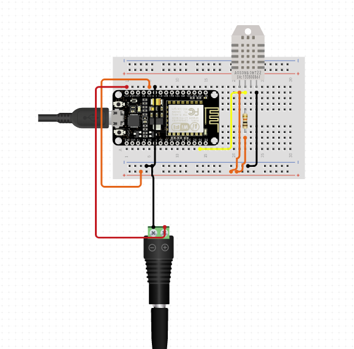

# Monitoring Room Temp & Humidity using Blynk

### Objectives:

* Setup the circuit with the NodeMCU and the DHT11 sensor.
* Configure/setup the Arduino IDE by installing the DHT11 library.
* Setup the Blynk App on your smartphone to include the display widget for both temperature and humidity.
* Write the code that will read the temperature and humidity values from the DHT11 sensor.

#### Explaining the components

* The DHT11 is a basic, ultra low-cost digital temperature and humidity sensor. It uses a capacitive humidity sensor and a thermistor to measure the surrounding air, and spits out a digital signal on the data pin \(no analog input pins needed\).


### Setting up the circuit:



1. Inset the DHT11 sensor on the breadboard as shown above.
2. Connect the Vcc pin on the sensor to the 3v pinon the NodeMCU.
3. Connect the GND pin of the sensor to the GND pin of the NodeMCU.
4. Connect the data/signal pin of the sensor to the digital pin D2 on the NodeMCU.

#### Configuring the Blynk app.

1. On the Blynk app create a new project and name it "Monitor Room". You will receive the authentication key via e-mail.
2. On the "+" icon add the Gauge widget and call name it "Temp". Assign it a virtual pin V5 and setup the value from 0 to 100.
3. Add another Gauge widget and call it "Humidity". Assign it a virtual pin V6 and setup the value from 0 to 100.
4. 
 To read from the DHT sensor, we’ll use the [DHT library from Adafruit](https://github.com/adafruit/DHT-sensor-library). To use this library you also need to install the [Adafruit Unified Sensor library](https://github.com/adafruit/Adafruit_Sensor). Follow the next steps to install those libraries.

1.  Open your Arduino IDE and go to **Sketch** &gt; **Include Library** &gt; **Manage Libraries**. The Library Manager should open.
2.  Search for “**DHT**” on the Search box and install the DHT library from Adafruit.


After installing the DHT library from Adafruit, type “**Adafruit Unified Sensor**” in the search box. Scroll all the way down to find the library and install it.


### The Code:

Add the following code to your Arduino IDE:

```text
#define BLYNK_PRINT Serial


#include <ESP8266WiFi.h>
#include <BlynkSimpleEsp8266.h>
#include <DHT.h>

// You should get Auth Token in the Blynk App.
// Go to the Project Settings (nut icon).
char auth[] = "YourAuthCode";

// Your WiFi credentials.
// Set password to "" for open networks.
char ssid[] = "";
char pass[] = "";

#define DHTPIN D2          // What digital pin we're connected to

// Uncomment whatever type you're using!
#define DHTTYPE DHT11     // DHT 11
//#define DHTTYPE DHT22   // DHT 22, AM2302, AM2321
//#define DHTTYPE DHT21   // DHT 21, AM2301

DHT dht(DHTPIN, DHTTYPE);
BlynkTimer timer;

// This function sends Arduino's up time every second to Virtual Pin (5).
// In the app, Widget's reading frequency should be set to PUSH. This means
// that you define how often to send data to Blynk App.
void sendSensor()
{
  float h = dht.readHumidity();
  float t = dht.readTemperature(); // or dht.readTemperature(true) for Fahrenheit

  if (isnan(h) || isnan(t)) {
    Serial.println("Failed to read from DHT sensor!");
    return;
  }
  // You can send any value at any time.
  // Please don't send more that 10 values per second.
  Blynk.virtualWrite(V5, h);
  Blynk.virtualWrite(V6, t);
}

void setup()
{
  // Debug console
  Serial.begin(9600);

  Blynk.begin(auth, ssid, pass);
  // You can also specify server:
  //Blynk.begin(auth, ssid, pass, "blynk-cloud.com", 80);
  //Blynk.begin(auth, ssid, pass, IPAddress(192,168,1,100), 8080);

  dht.begin();

  // Setup a function to be called every second
  timer.setInterval(1000L, sendSensor);
}

void loop()
{
  Blynk.run();
  timer.run();
}
```

* On line 10 of the code above include the authentication key that was sent to you via email.
* Also add the ssid and password of the local network that you would like to connect to.
* Upload the code to your NodeMCU dev board.
* Open your Blynk app again and then press the "play" icon to run your project. You should be able to see the Humidity and temperature.


