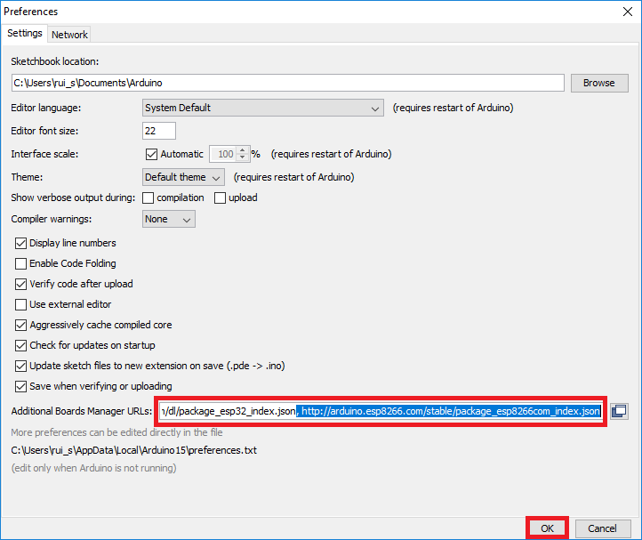

# Getting Started

Before we can use the NodeMCU board we need to install the ESP8266 board and it's library on the  Arduino IDE in order to use the WiFi functionality. This will be done as follows:

Open the Arduino IDE software on your computer. Go to   **File**&gt; **Preferences**  

Add the link: [http://arduino.esp8266.com/stable/package\_esp8266com\_index.json](http://arduino.esp8266.com/stable/package_esp8266com_index.json) to the “Additional Boards Manager URLs” field as shown in the figure below. Then, click the “OK” button:

 Open the "Boards Manager" and go to  **Tools** &gt; **Board** &gt; **Boards Manager**  

Search for ESP8266  and press install button for the “**ESP8266 by ESP8266 Community**“:

