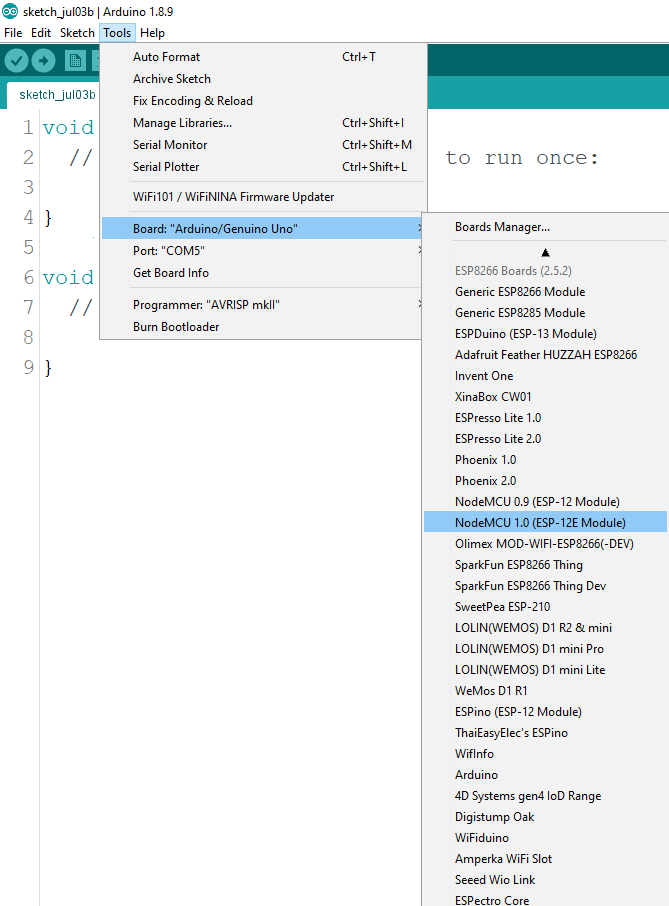

# A simple test for ESP8266

In order to test the ESP8266 installation we will be doing a similar circuit setup as we previously did with the Arduino Uno in the last activity.  

#### What will you need ?

* NodeMCU board 
* A breadboard 
* male-to-male jumper cables 

For this activity we will be using the ESP-12E NodeMCU developmental kit. So we will setup the Arduino IDE as follows:  

