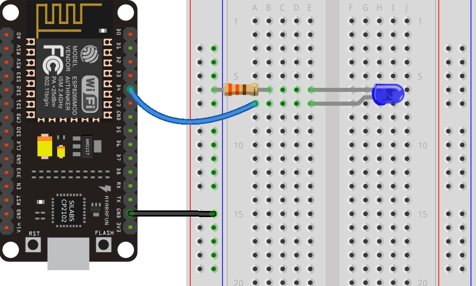
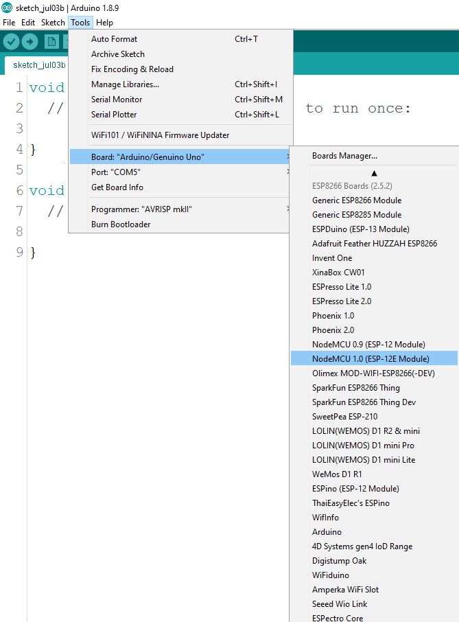
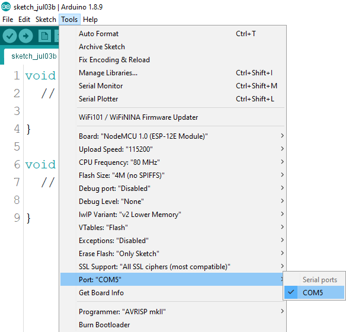

# A simple test for ESP8266

In order to test the ESP8266 installation we will be doing a similar circuit setup as we previously did with the Arduino Uno in the last activity.  

#### What will you need ?

* NodeMCU ESP8266 DEV kit board 
* A breadboard 
* male-to-male jumper cables

The first thing  that you will do is setup the circuit and then connect the USB cable to both the NodeMCU board and the computer you will be using for this activity.

 

For this activity we will be using the ESP-12E NodeMCU developmental kit. So we will setup the Arduino IDE as follows:  

Select the relevant port that is communicating with your NodeMCU board:

