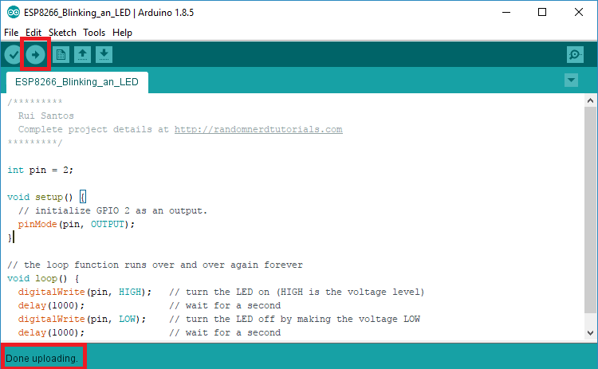

# The Code

The following code can be copied and pasted in your Arduino IDE:

```text
int pin = 2;

void setup() {
  // initialize GPIO 2 as an output.
  pinMode(pin, OUTPUT);
}

// the loop function runs over and over again forever
void loop() {
  digitalWrite(pin, HIGH);   // turn the LED on (HIGH is the voltage level)
  delay(1000);               // wait for a second
  digitalWrite(pin, LOW);    // turn the LED off by making the voltage LOW
  delay(1000);               // wait for a second
}
```

 Once you are done you can upload the code to the NodeMCU. When the code runs you should be able to see the LED blinking. It will turn on for 1 second and turn off for 1 second. 



