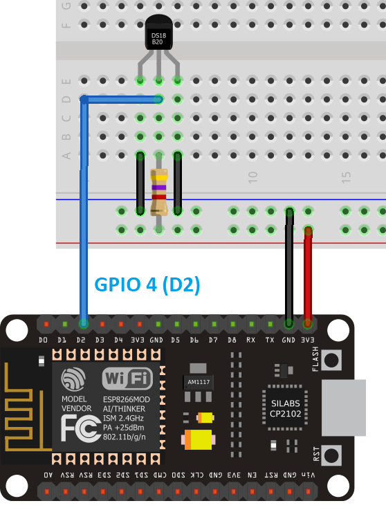

# Read and Display temperature sensor  readings with NodeMCU.

#### What will you need ?

* DS18B20 temperature sensor
* NodeMCU ESP8266 Dev kit board.
* male-to-male jumper wires 
* 4.7 k Ohm resistor 

#### Setup the circuit 

The DS18B20 temperature sensor can connected in two different configurations, namely, parasite mode and normal mode as follows:

#### Normal Mode 

#### Parasite Mode 

