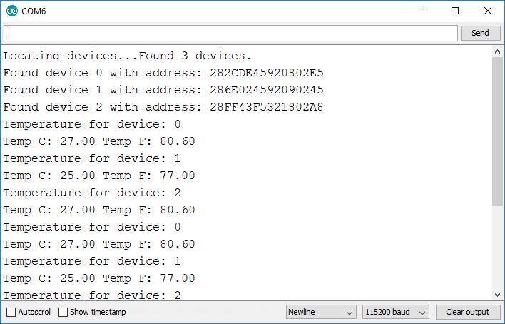

# The Code

The first thing that you need to do is to write code to determine the number of DS18B20 sensors that are connected to the GPIO pin 4. This is done by using the following method:

```text
numberOfDevices = sensors.getDeviceCount();
```

Next you need to get the unique addresses of the sensors:

```text
if(sensors.getAddress(tempDeviceAddress, i)){
```

 Use the following method to get temperature from a specific sensor:

```text
float tempC = sensors.getTempC(tempDeviceAddress);
```

To get the temperature in Fahrenheit degrees, you can use the getTemF\(\). Alternatively, you can convert the temperature in Celsius to Fahrenheit as follows:

```text
DallasTemperature::toFahrenheit(tempC)
```

The full code will be as follows:

```text
#include <OneWire.h>
#include <DallasTemperature.h>

// Data wire is plugged TO GPIO 4
#define ONE_WIRE_BUS 4

// Setup a oneWire instance to communicate with any OneWire devices (not just Maxim/Dallas temperature ICs)
OneWire oneWire(ONE_WIRE_BUS);

// Pass our oneWire reference to Dallas Temperature. 
DallasTemperature sensors(&oneWire);

// Number of temperature devices found
int numberOfDevices;

// We'll use this variable to store a found device address
DeviceAddress tempDeviceAddress; 

void setup(){
  // start serial port
  Serial.begin(115200);
  
  // Start up the library
  sensors.begin();
  
  // Grab a count of devices on the wire
  numberOfDevices = sensors.getDeviceCount();
  
  // locate devices on the bus
  Serial.print("Locating devices...");
  Serial.print("Found ");
  Serial.print(numberOfDevices, DEC);
  Serial.println(" devices.");

  // Loop through each device, print out address
  for(int i=0;i<numberOfDevices; i++){
    // Search the wire for address
    if(sensors.getAddress(tempDeviceAddress, i)){
      Serial.print("Found device ");
      Serial.print(i, DEC);
      Serial.print(" with address: ");
      printAddress(tempDeviceAddress);
      Serial.println();
    } else {
      Serial.print("Found ghost device at ");
      Serial.print(i, DEC);
      Serial.print(" but could not detect address. Check power and cabling");
    }
  }
}

void loop(){ 
  sensors.requestTemperatures(); // Send the command to get temperatures
  
  // Loop through each device, print out temperature data
  for(int i=0;i<numberOfDevices; i++){
    // Search the wire for address
    if(sensors.getAddress(tempDeviceAddress, i)){
      // Output the device ID
      Serial.print("Temperature for device: ");
      Serial.println(i,DEC);
      // Print the data
      float tempC = sensors.getTempC(tempDeviceAddress);
      Serial.print("Temp C: ");
      Serial.print(tempC);
      Serial.print(" Temp F: ");
      Serial.println(DallasTemperature::toFahrenheit(tempC)); // Converts tempC to Fahrenheit
    }
  }
  delay(5000);
}

// function to print a device address
void printAddress(DeviceAddress deviceAddress) {
  for (uint8_t i = 0; i < 8; i++){
    if (deviceAddress[i] < 16) Serial.print("0");
      Serial.print(deviceAddress[i], HEX);
  }
}
×
Drag and Drop
The image will be downloaded
```

Upload this code to the NodeMCU board and this is what you will see once successfully uploaded:




