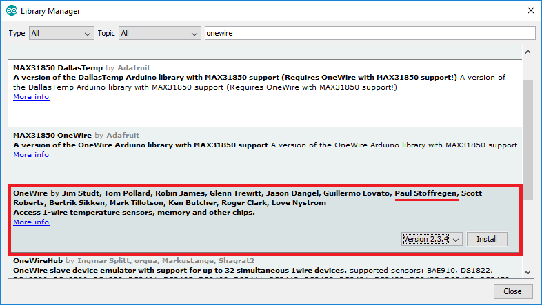

# Installing libraries for DS18B20 temperature sensor.

To start using the DS18B20 temperature sensor you need to install the library for it in order to be able to allow the NodeMCU board to communicate with it. 

To be able to communicate with the DS18B20 sensor you will need to install the **One Wire** library and the **Dallas Temperature** library. 

On your computer open the Arduino IDE software and open the library manager as follows  **Sketch** &gt; **Include Library** &gt; **Manage Libraries**. and then type "onewire" in the search box and select one wire library by Paul Stoffregen: 

The next step is to search for "dallas temperature" and then install the library by Miles Burton:

