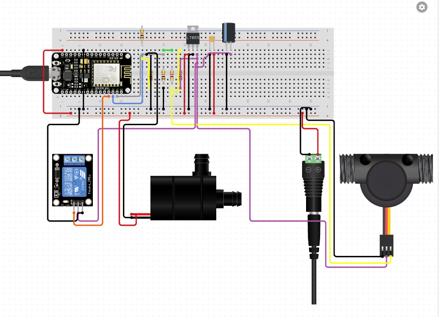

# Read and display the water flow sensor on Blynk

### What will you need?

* NodeMCU with USB cable
* Water Flow Sensor
* Relay Switch 
* Blynk App 

#### Setting up the circuit

1. Connect the yellow wire from the water flow sensor to pin D2 of the NodeMCU board.
2. Connect the black wire to the ground pin of the NodeMCU. Connect the red wire to the 3.3V pin.
3. Download and install the Blynk app to your smartphone. Open the app and set up a New Project. The authentication key will be sent to you via the email that you used to register the Blynk app.
4. 

