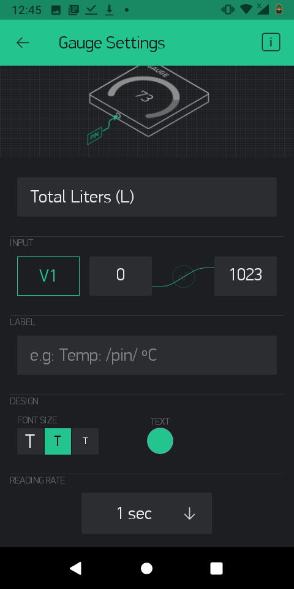
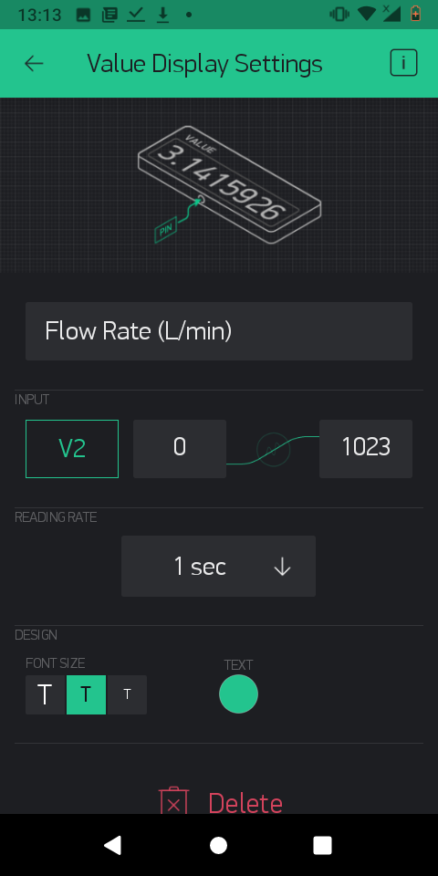

# Setting up Blynk

For this activity we need to setup the Blynk app to communicate with the NodeMCU app to be able to read the water flow sensor. 

The first thing you will need to do is to have the Blynk app installed on your smartphone. For Android users, go to the Google Play Store and search "Blynk". Choose the one written "Blynk-IoT for Arduino, ESP8266, Raspberry Pi".

Once installed, setup your own account using your e-mail address.   
  
Create a "New Project" and name it Centurion Gate Motor. Once you are done, add the gauge widget and then label it "Total Liters \(L\)". Assign it a virtual pin of V1 and set it to take/send readings every second. 

Add a Value display widget and name it "Flow Rate \(L/min\)". Assign it a virtual pin V2  and set it to send data every second.   

Add an interrupt button that will allow you to reset the total amount of water that has flowed. In Blynk add the button widget. label it "Reset" and assign it a virtual pin V4.

