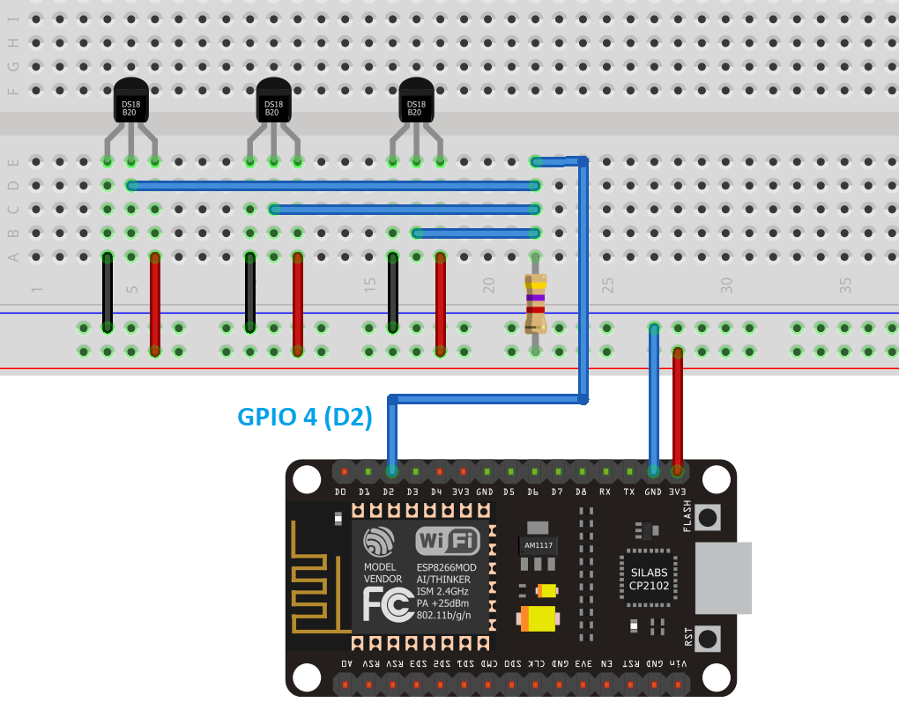

# Getting temperature readings from different DS18B20 sensors.

**What will you need ?**

* 3x DS18B20 sensors
* NodeMCU ESP8266 Dev kit board 
* male-to-male jumper wires
* One 4.7k Ohm resistors

#### The circuit for the multiple DS18B20 sensors is as follows:

