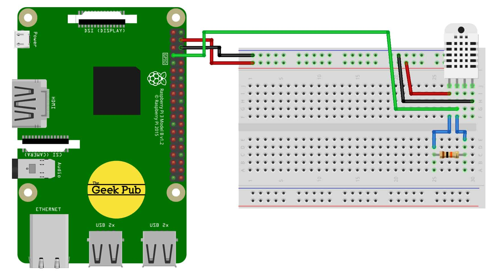

# Setting up DHT11 on Raspberry Pi

**Step 1**: The first thing that you will need to do is to wire the circuit for the DHT11 sensor with the Raspberry Pi. The VCC pin of the sensor will be connected to the 5V pin on the Raspberry Pi, GND will be connected to the GND of the Pi, lastly the DATA pin will be connected to GPIO 4 on the Raspberry Pi.

 **Step 2:**  
  

