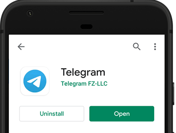

# Using Telegram To Control Outputs

In this project we will be creating a Telegram bot that will be used in conjunction with the NodeMCU board to control the output devices which is the built-in LEDs. 

**These are the following tasks that need to be completed in this project:**

* Create a Telegram bot for the ESP8266 board.
* You can start the conversation with the bot.
* When you send message /led\_on to the bot, the ESP board receives the message and then it turns on the GPIO 2. 
* similarly, when you send the message /led\_off it turns GPIO 2 off. 
* You can also send the message /state to request the current GPIO state. 

**Create A Telegram Bot:**

**Step 1:** The first thing that you will need to do is to go to the Google Play Store and download the Telegram Messenger App.

**Step 2:** 

